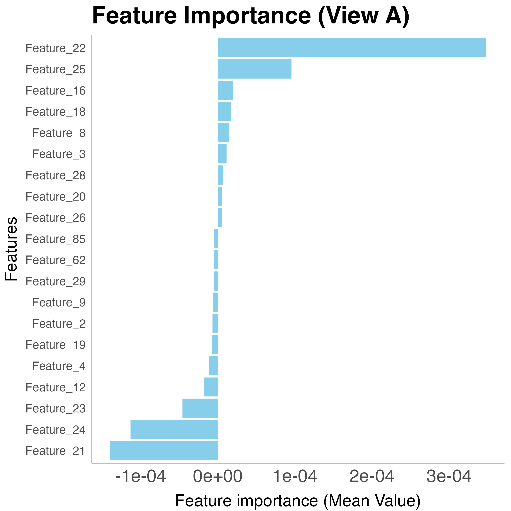
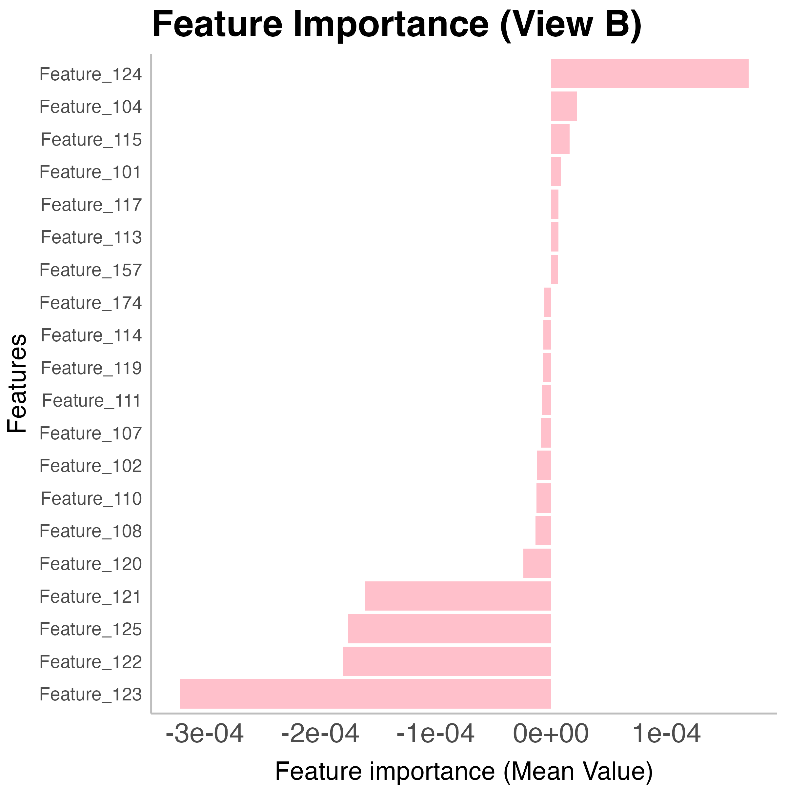
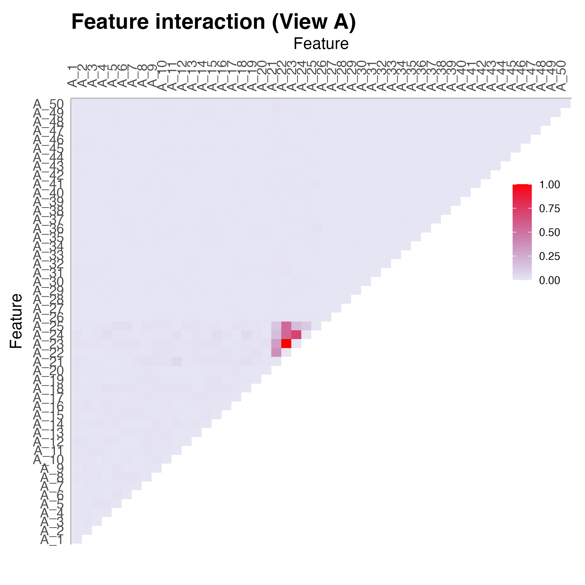
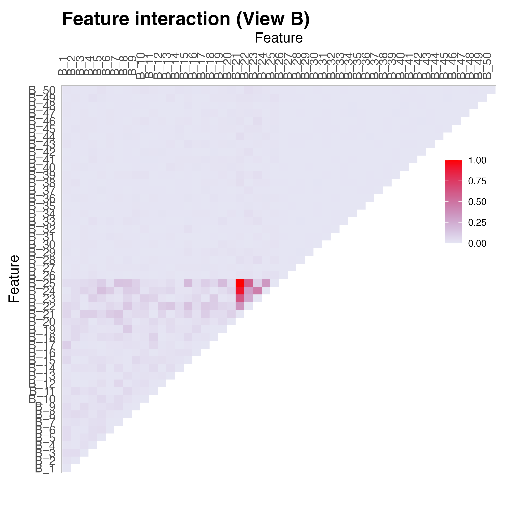

# COSIME: Cooperative multi-view integration and Scalable and Interpretable Model Explainer

Cooperative Multiview Integration and Scalable and Interpretable Model Explainer (COSIME) is a machine learning model that integrates multi-view data for disease phenotype prediction and computes feature importance and interaction scores. By leveraging deep learning-based encoders, COSIME effectively captures the complex, multi-layered interactions between different omic modalities while preserving the unique characteristics of each data type. The integration of LOT techniques aligns and merges heterogeneous datasets, improving the accuracy of modeling across-view relationships in the joint latent space. In addition, COSIME leverages the Shapley-Taylor Interaction Index\cite{Dhamdhere2019a} to compute feature importance and interaction values, allowing for a deeper understanding of how individual features and their interactions contribute to the predictions.


## Installation
1. Clone and navigate to the respository.
```bash
https://github.com/jeromejchoi/COSIME
cd COSIME
```
2. Create and activate a virtual environment for python 3.10.14 with `conda` or `virtualenv`.
```bash
# conda
conda create -n COSIME python=3.10.14
conda activate COSIME

# virtualenv
source COSIME/bin/activate  # on Linux/Mac
COSIME\Scripts\activate  # on Windows
```
3. Install dependencies for production and development with `pip`.
```bash
pip install -r requirements.txt
pip install -r requirements-dev.txt
```
## Example: Simulated data (Binary outcome - high signal & late fusion)
### Training and Predicting
```bash
python main.py \
  --input_data_1="data_1.csv" \
  --input_data_2="data_2.csv" \
  --type="binary" \
  --predictor="regression" \
  --fusion="early" \
  --batch_size=32 \
  --learning_rate=0.0001 \
  --learning_gamma=0.99 \
  --dropout=0.5 \
  --KLD_A_weight=0.02 \
  --KLD_B_weight=0.02 \
  --OT_weight=0.02 \
  --CL_weight=0.9 \
  --dim=100 \
  --earlystop_patience=40 \
  --delta=0.001 \
  --decay=0.001 \
  --save="/path/to/output" \
  --log="/path/to/output/logfile.log"
```
#### Parameters Overview

##### Input Data
- **input_data_1**: Input data 1.
- **input_data_2**: Input data 2.

##### Model Configuration
- **type**: Outcome type, either binary (classification) or continuous (regression).
- **predictor**: Type of model used for continuous outcomes (regression or NN).
- **fusion**: Fusion method (early or late).

##### Training Settings
- **batch_size**: Number of samples processed in one pass.
- **learning rate**: Controls how much weights are adjusted during training.
- **learning gamma**: Rate at which the learning rate decays during training.
- **dropout**: Probability of randomly dropping neurons during training to prevent overfitting.

##### Loss Weights
- **KLD_A_weight**: Weight for the KLD loss (view A).
- **KLD_B_weight**: Weight for the KLD loss (view B).
- **OT_weight**: Weight for the LOT loss.
- **CL_weight**: Weight for the prediction loss.

##### Latent Space
- **dim**: Size of the joint latent space where multiple views are represented.

##### Stopping and Regularization
- **earlystop_patience**: Number of epochs to wait without improvement before stopping training.
- **delta**: Minimum improvement required to reset early stopping counter.
- **decay**: How much the learning rate decreases during training.

##### File Paths
- **save**: Path to save model outputs and history (training history, holdout evaluation history, and the best model).
- **log**: Path to save the training logs.


#### Results
```bash
```


### Computing Feature Importance and Interaction
```bash
python main.py \
  --input_data="binary_high_late.df.csv" \
  --input_model="best_model_binary_high_late.pt" \
  --model_script_path="model_binary_high_late.py" \
  --input_dims="100,100" \ 
  --fusion="late" \
  --dim 150 \
  --dropout 0.5 \
  --mc_iterations 50 \
  --batch_size 32 \
  --interaction True \
  --save="Results" \
  --log="log_binary_high_late.log" \
```
#### Parameters Overview

##### Input Data and Model
- **input_data**: Holdout multi-view dataset (without labels).
- **input_model**: Trained model.
- **model_script_path**: Model class used in training the model.
- **input_dims**: Dimensions in two input data views.

##### Model Configuration
- **fusion**: Fusion method (early or late).
- **dim**: Size of the joint latent space where multiple views are represented.
- **dropout**: Probability of randomly dropping neurons during training to prevent overfitting.

##### Monte Carlo and Sampling
- **mc_iterations**: Number of Monte Carlo sampling iterations.
- **batch_size**: Number of samples processed together in one forward pass through the model.
- **interaction**: Compute both feature importance and pairwise feature interaction (True) or just feature importance (False).

##### File Paths
- **save**: Path to save the outputs.
- **log**: Path to save the training logs.

  
#### Results
|  |  |
|:-------------------------------------------------:|:-------------------------------------------------:|
| *Legend for Figure 1: Description or legend here* | *Legend for Figure 2: Description or legend here* |

|  |  |
|:-------------------------------------------------:|:-------------------------------------------------:|
| *Legend for Figure 3: Description or legend here* | *Legend for Figure 4: Description or legend here* |

It is estimated to take approximately 7.53 hours on an Apple M1 Max with 10 physical cores and 32 GB of Unified Memory, or approximately 1.1 hours on an Intel Xeon Gold 6140 system with 36 physical cores, 200 GB of RAM, and 25.3 MB of L3 cache.
