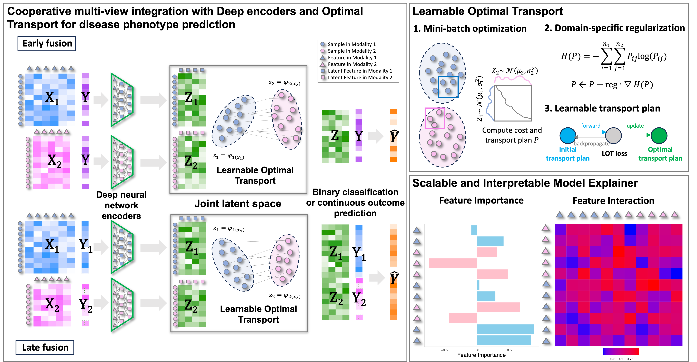

# COSIME: Cooperative multi-view integration and Scalable and Interpretable Model Explainer

Cooperative Multiview Integration and Scalable and Interpretable Model Explainer (COSIME) is a machine learning model that integrates multi-view data for disease phenotype prediction and computes feature importance and interaction scores. By leveraging deep learning-based encoders, COSIME effectively captures the complex, multi-layered interactions between different omic modalities while preserving the unique characteristics of each data type. The integration of LOT techniques aligns and merges heterogeneous datasets, improving the accuracy of modeling cross-modality relationships in the joint latent space. After training a model, COSIME leverages the Shapley-Taylor Interaction Index to compute feature importance and interaction values, allowing for a deeper understanding of how individual features and their interactions contribute to the model's predictions.



## Installation
1. Clone and navigate to the respository.
```bash
https://github.com/jeromejchoi/COSIME
cd COSIME
```
2. Create and activate a virtual environment for python 3.10.14 with `conda` or `virtualenv`.
```bash
# conda
conda create -n COSIME python=3.10.14
conda activate COSIME

# virtualenv
source COSIME/bin/activate  # on Linux/Mac
COSIME\Scripts\activate  # on Windows
```
3. Install dependencies for production and development with `pip`.
```bash
pip install -r requirements.txt
pip install -r requirements-dev.txt
```
## Example: Simulated data (Binary outcome - high signal & late fusion)
### Training and Predicting
```bash
python main.py \
  --input_data_1="data_1.csv" \
  --input_data_2="data_2.csv" \
  --type="binary" \  # or "continuous"
  --predictor="regression" \ # or "NN" (when continuous)
  --fusion="early" \ or "late"
  --batch_size=32 \
  --learning_rate=0.0001 \
  --learning_gamma=0.99 \
  --KLD_A_weight=0.02 \
  --KLD_B_weight=0.02 \
  --OT_weight=0.02 \
  --CL_weight=0.9 \
  --dropout=0.5 \
  --dim=100 \
  --earlystop_patience=40 \
  --delta=0.001 \
  --decay=0.001 \
  --save="/path/to/output" \
  --log="/path/to/output/logfile.log"
```

### Computing Feature Importane and Interaction
```bash

python main.py \
  --input_data="binary_high_late.df.csv" \
  --input_model="best_model_binary_high_late.pt" \ # trained model
  --model_script_path="model_binary_high_late.py" \ # please use your model class
  --input_dims="100,100" \ # dimensions in two data
  --fusion="late" \ # or "early"
  --save="Results" \
  --log="log_binary_high_late.log" \
  --dim 150 \
  --dropout 0.5 \
  --mc_iterations 10 \
  --batch_size 32 \
  --interaction True # False if you need feature importance only
```
It is estimated to take approximately 1.5 hours on an Apple M1 Max with 10 physical cores and [32GB] of Unified Memory.
